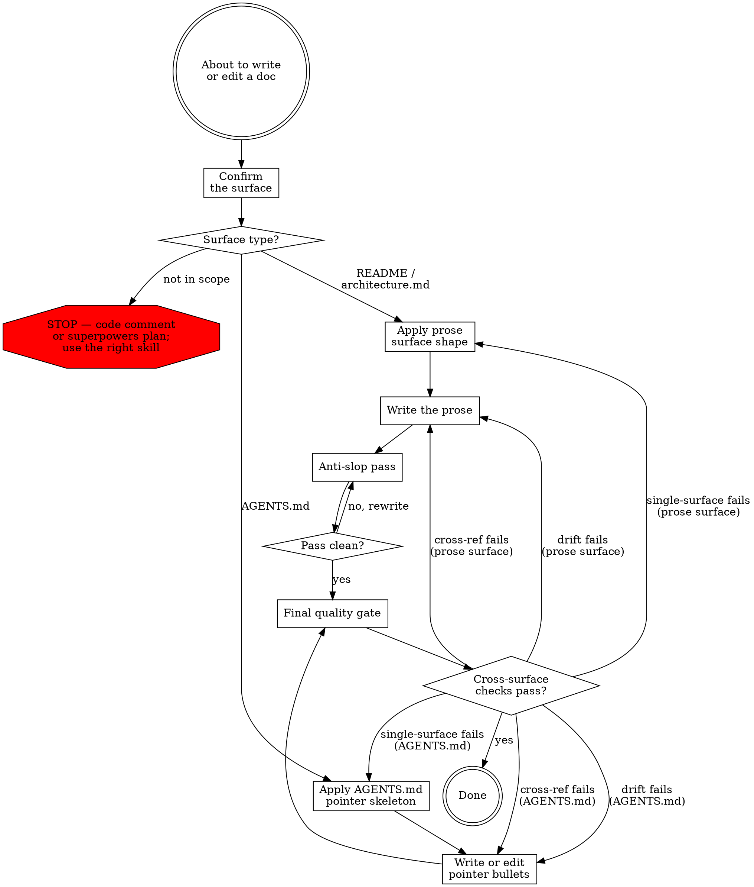

# Writing Docs

The repository has three documentation surfaces and one invariant: **no sentence appears on more than one surface**.

- **Human prose** — root `README.md`, `docs/architecture.md`. Audience is an experienced Python developer reading for task-fit.
- **LLM pointer map** — root `AGENTS.md`. Audience is the coding agent navigating the project before edits. AGENTS.md is opaque to humans by policy.

Out of scope: code comments (use the `writing-python-code` skill — point-of-use *why* lives at the call site, classified per-comment during code work) and procedural artifacts under `docs/superpowers/`.

## Workflow

### Confirm the surface

Name the single surface this content belongs on:

- **Root `README.md`** — pitch, install, CLI usage, library usage, not-supported summary, development pointer, license. User-facing.
- **`docs/architecture.md`** — pipeline narrative, internal invariants, recipe table, extension bundling, per-case reasoning for not-supported items. Read after the README.
- **Root `AGENTS.md`** — LLM-targeted pointer map into README and architecture.md. Pointer-only; no human prose.

If the content is a point-of-use *why* in code (a comment / docstring) or a procedural plan/spec under `docs/superpowers/`, this skill does not apply. STOP and use the correct surface authoring path.

The next steps branch by surface type. Apply only the branch that matches.

### Apply the surface shape

**Human prose surfaces** (root README / `docs/architecture.md`). Each has a fixed shape that is not yours to refine mid-edit. Load `references/surface-shapes.md` for the root README structure (pitch / install / CLI / library / not-supported / development / license), the architecture.md layout (rationale / pipeline / mechanisms / not-supported reasoning), the §Contracts H/R/NC pattern available when an invariant emerges, and the no-self-describing-intro rule.

**AGENTS.md.** Load `references/agents-md.md` for the pointer-bullet skeleton (sections, 3-8 bullets, ≤30 lines hard ceiling), the LLM-only opacity rule (no human pitch, no welcome copy, no narrative motivation), and the CLAUDE.md companion convention.

### Write the content

**Human prose surfaces.** Apply while writing, not as a retroactive pass: sentences ≤25 words averaging 12-17, active voice predominant, paragraphs ≤4 sentences, headings that predict their content. Skip jargon for Python stdlib and language vocabulary (the audience is not a novice) — leave `pathlib.Path`, `dataclass`, `with`-block, `pytest fixture`, `monkeypatch` undefined. Define project-specific jargon once at `docs/architecture.md` §<term> and never re-define. Include a number only when the reader cannot derive it from surrounding text. Reject Flesch-Kincaid 8-12 rewrites — developer docs target FK 10-14. Reject "prefer diagrams" mandates — add a diagram only when a table cannot express the relationship.

**No self-describing intros.** Documentation files do not open with "This document covers X / for Y see Z" prefaces. The H1 already names the topic. Jump straight to the first content section. Cross-references attach inline to the paragraph that benefits from them, not to a meta-preface.

Load `references/writing-style.md` for the keep-vs-strip examples for numbers, the worked rejections of consumer-readability heuristics, and the heading-predicts-content failure modes.

**AGENTS.md.** Write pointer bullets, not prose. Every bullet under `## Before editing` ends with `(README §<heading name>)` or `(architecture.md §<heading name>)` pointing at a real heading. No motivation in the bullet — motivation lives in the README or architecture.md; AGENTS.md only points at it. Front-load by stakes: the first bullet under `## Before editing` carries the most attention weight, so order by stakes rather than by source-file order. Cross-refs use `§<heading name>`, never line numbers, never anchor links — headings survive edits, line numbers don't.

The `references/agents-md.md` reference loaded above carries the banned-pattern examples (no human-facing motivation, no narrative intros, no line-numbered cross-refs) and the worked WRONG/CORRECT pairs.

### Anti-slop pass

**Skip this step for AGENTS.md.** AGENTS.md is bullet pointers, not prose; the slop fingerprint does not apply.

For human prose surfaces, after the draft is in place, run a literal scan against the slop fingerprint. Search for em (—) and en (–) dashes and remove every instance. Re-read each word against the banned vocabulary lists. Check for banned sentence patterns and description formats. Vary sentence rhythm. Replace abstractions with specifics — name the function, the flag, the file, the limit.

Load `references/anti-ai-slop.md` for the banned vocabulary tables (verbs / adjectives / nouns / adverbs / intensifiers), the banned sentence patterns (contrastive reframe, hedging filler, formulaic transitions, summary openings, "this" + abstract noun, rule of three), the banned description formats, the sentence-rhythm and concreteness examples, and the tone and formatting discipline.

Rewrite affected text and re-check. Do not exit this step until the draft passes every check.

### Final quality gate

Three cross-surface checks. Run them after the surface-specific work above is complete:

**Single-surface principle.** No sentence appears on more than one surface. For each paragraph (human prose) or bullet (AGENTS.md) in the diff, scan whether the same content already lives on another surface (README / architecture.md / AGENTS.md / code comments). If it does, replace this one with a `(README §X)` or `(architecture.md §Y)` pointer, or delete the duplicate at the other surface — keep the version on the surface that already owns the content. Common drifts: a README install line restated under architecture.md, a pipeline step paraphrased in AGENTS.md, an AGENTS.md bullet that summarizes its README pointer instead of pointing at it.

**Cross-ref integrity.** If you renamed any heading on this surface, search for `§<old name>` across every surface type and update every cross-ref in the same edit. AGENTS.md cross-refs README / architecture.md headings by name, so a heading rename without an AGENTS.md sweep silently breaks the pointer map.

**Code-vs-claim sweep.** For each behavior claim in the diff (this surface or any cross-ref'd surface), verify the code currently enforces it. A pipeline step that says "X happens before Y" must match what `compact_database` actually does; an AGENTS.md bullet that says "wrap path strings in `_escape_sql_literal` before SQL interpolation" must match the function bodies the bullet points at. A claim drifted from the code is a half-fixed doc — either fix the doc to match current code, or fix the code to match the contract — but a doc edit that ships drifted is a regression, not a doc fix.

If single-surface fails, return to *Apply the surface shape*: keep the content on the surface that already owns it, delete the duplicate, and replace it with a pointer at the second site. If cross-ref integrity fails, return to *Write the content* and update every `§<old name>` cross-ref in the same edit. If code-vs-claim drift fails, return to *Write the content* and reconcile the doc with current code; escalate to a code change if the doc is intended to drive the implementation rather than describe it.
