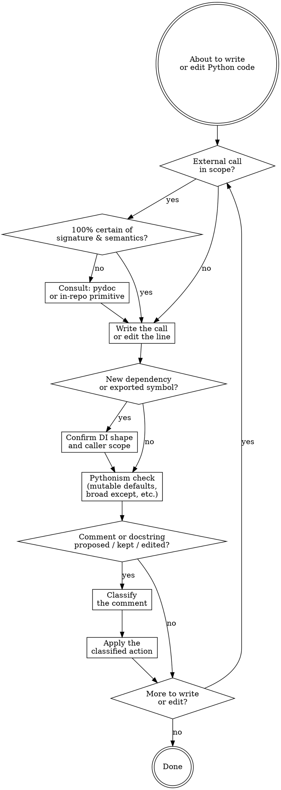

# Writing Python Code

## Workflow

### Confirm the API call

Before writing or editing a call to any Python symbol — stdlib or third-party — ask: am I 100% certain of this symbol's signature, exception behavior, and edge-case semantics, or am I pattern-matching from training? Built-ins always in head (`len`, `range`, `enumerate`, `zip`, `isinstance`) proceed. Anything else, including `pathlib.Path` methods, `re` module functions, `duckdb.DuckDBPyConnection.execute` row-shape, and `typer` decorators: `python -m pydoc <fully.qualified.name>` first.

Skip when: the call mechanically repeats an idiom already established in the same file, or the call already runs and a test exercising it passes.

Load `references/pydoc.md` for the query-shape table (single symbol vs `-w` HTML dump vs `-k` keyword search vs source-file read), escalation to reading the package source, and the don't-consult exceptions.

When the call would build a SQL literal, load a DuckDB extension, format a byte count, or compute a file path the rest of the codebase wraps, the project may already carry a helper. Search the repo for the helper before reaching for the stdlib or DuckDB primitive directly. `pydoc` confirms the call works the way you remember; the in-repo lookup confirms it's the right call to make at all. Load `references/in-repo-primitives.md` for the lookup table and the decision test.

### Confirm dependencies and surface scope

After the line is written or edited, two architectural checks fire before moving to the Pythonism scan. Skip both when the edit is a single statement inside an existing function that introduces neither a new dependency nor a new exported symbol.

**Dependency entry shape.** When the line introduces a new dependency — a callable, an external service, configuration, time source, randomness source, output stream — does the function obtain it via parameter, keyword argument, or constructor field, or does it reach for it (module-level singleton, free `os.environ.get`, hidden global, in-line `sys.stdout`)? Reach-for forms hide test seams and force globals to grow. Default to parameter or keyword-argument entry. Reach for only when the value is genuinely process-wide and unconfigurable, and even then prefer a module-level seam (`_stdout: TextIO = sys.stdout`) over an in-line reference so a test can swap it under `monkeypatch.setattr`.

**Caller scope for new public symbols.** When the line adds a new public symbol (a function, class, or constant not prefixed with `_`), the same coordinated unit of work must add at least one non-test caller and update `__init__.py`'s `__all__` if the symbol is part of the package's public surface. A public symbol with no caller anywhere in the unit is scaffolding — delete it, keep it underscore-prefixed until the caller lands, or hold the export until the caller is part of the same coordinated change. Holding is acceptable; speculative public surface is not.

### Pythonism check

Python carries a set of language footguns that look like working code until they aren't. Scan the line you just wrote against each:

- **Mutable default arguments.** `def f(items=[])` shares one list across every call. Use `None` and check inside, or use a dataclass with `field(default_factory=list)`.
- **Broad `except Exception`** or bare `except:`. The fail-hard rule applies: either name the specific exception you intend to handle, or let it propagate. `except BaseException` is allowed in narrow cleanup scopes (e.g. `compact_database`'s post-attach unwind), and it must re-raise.
- **Silent truthiness on `None` vs falsy collections.** `if not config:` fires on both `None` and `{}`. Use `if config is None:` when None-vs-empty matters.
- **String-formatted SQL.** Allowed only because DuckDB does not bind DDL parameters. Every interpolated string literal goes through `_escape_sql_literal`, every identifier is double-quoted. See in-repo primitives.
- **Path string concatenation.** Use `pathlib.Path` operators (`/`, `.with_suffix`, `.parent`). Never `os.path.join` on `Path` instances or `f"{base}/{name}"` for path construction.
- **`from __future__ import annotations`.** Required at the top of every source file under `src/` and every test file. The project's mypy is strict-mode under `python_version = "3.10"`, so `dict[str, str]`, `list[T]`, and `X | None` annotations must be deferred-evaluated.
- **Type hint coverage.** Every function under `src/` has fully annotated parameters and return type. The override that relaxes annotations applies to `tests/` only, not source. `Any` requires justification at the call site (`warn_return_any` makes returning `Any` a configured warning).
- **`dataclass(frozen=True)`** for value carriers. The current `CompactionResult` / `RestoreResult` shape is the template.

### Classify each comment

Default: write no comment, no docstring. Only write or keep one when it carries point-of-use *why* — a hidden constraint, subtle invariant, bug workaround, or deliberate tradeoff that the reader cannot infer from the code. When deleting code, also delete any why-comment above it; an orphaned why is dead weight.

For every comment or docstring proposed, kept, or edited, classify it and apply the listed action. Load `references/comments.md` for the full classification table (load-bearing why / public docstring / explains-what / tutorial / over-specified / redundant-with-architecture), a worked load-bearing-why example, the banned-pattern examples (no `# see README §X` backlinks, no line-numbered cross-refs), and the docstring compression rule for public symbols.
