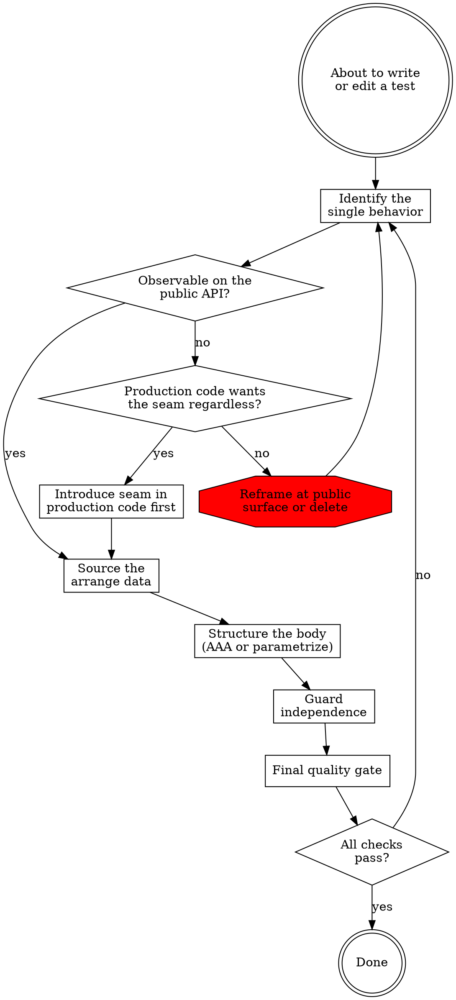

# Writing Tests

The project's tests live under `tests/`, separate from `src/`. Fixtures (DuckDB artifacts and the like) live under `tests/fixtures/`. Shared pytest fixtures live in `tests/conftest.py`. Tests use plain `assert` and `pytest.raises`; tables are written via `@pytest.mark.parametrize`; temp filesystem state uses the built-in `tmp_path` fixture.

## Workflow

### Identify the single behavior

Articulate the behavior in one sentence using business language. The test name is a paraphrase of that sentence (`test_compact_rejects_views`, not `test_duckdb_views_call`). If the sentence contains `and`, you have two tests. If it names an implementation choice (which dependency was called, internal call order, algorithmic decomposition), you have no test.

When the behavior is real but not observable through the current public API, the diamond branches three ways: introduce a production-code seam (a `*, out: TextIO = sys.stdout` keyword argument, a module-level singleton the test reassigns via `monkeypatch.setattr`, an exported pure helper the test calls directly, or a Protocol-typed dependency the constructor accepts) so the behavior becomes observable through the seam; reframe the test at a public surface that already covers the behavior; or delete the candidate as implementation detail. Choose seam-introduction only when the seam will outlive the test — when production code wants the injection point regardless of testability. A seam introduced solely to test through is the same "test the private helper" smell, dressed in a keyword argument.

Load `references/behavior.md` and classify the candidate against the do-test / don't-test list, the carve-outs (testing private helpers when the invariant cannot be observed externally; constructors that validate or transform input; drift-guard tests that assert registry parity), and the seam patterns surfaced by the current codebase.

### Source the arrange data

A reader of only this test must be able to tell what the inputs are and where they came from. Choose one source:

- `populated_db` / `bloated_db` / `hnsw_db` / `shopware_cli_index` — shared fixtures defined in `tests/conftest.py`
- A file under `tests/fixtures/` referenced through the `shopware_cli_index` fixture (or a new fixture you add to `conftest.py` for new artifacts)
- A local-to-the-test fixture defined inside the same test module via `@pytest.fixture` (acceptable when only that module needs it; promote to `conftest.py` on the third user)
- Inline literal — single-line input, malformed-shape test, narrow unit
- `tmp_path` — fresh empty filesystem state per test (built-in pytest fixture)
- `tmp_path_factory` — session-shared expensive setup (use sparingly; the per-test isolation of `tmp_path` is the default)

Load `references/data.md` for the acceptable-vs-flagged paths table (absolute paths, cross-package fixture borrow, dynamic globs), the descriptive-name conventions for paths and identifiers, the 5-line / 3-occurrence rule for helper extraction with `pytest.fixture` placement, and the large-fixture pattern for the committed `shopware-cli-chunks.duckdb`.

### Structure the body

Pick the shape: AAA-separated body for 5+ statements, or parametrized table of 2-3 statements per case. Then write the body without conditional logic that picks between assertions. If you reach for an `if`/`match`/loop branch on a test expectation, stop — either you need the `expect_error` carve-out (success-path assertions identical across rows), or you need to split into two test functions.

Load `references/shape.md` for the `pytest.raises` pattern, the platform-skip / slow-mark carve-outs that are not violations, the assertion-scope rule (multiple `assert` statements only when they verify one logical behavior), and the naming and ordering conventions.

### Guard independence

Ask: would `pytest -p no:cacheprovider --randomly-seed=<n>` (under `pytest-randomly` if installed), `pytest -k <one_test>`, or future `pytest-xdist` adoption change the outcome? If yes, the test depends on state outside its body.

Load `references/independence.md` for the four leak vectors (module-level mutable state, fixture-scope mismatches, unrestored globals, wall-clock or randomness in asserted values), the allowed clock / PRNG contexts (deterministic seeds, fixed `datetime`), and the `monkeypatch` restoration pattern for any global mutation.

### Final quality gate

Two checks span individual steps and are most often skipped. Run them after the body is drafted:

**Redundancy.** Every parametrize case and every top-level test covers a unique code path, boundary value, or regression. Key on *why* the case exists, not on *what* the input looks like. Three cases that exercise the same branch with different magnitudes is one case. Before flagging a case as redundant, scan its `id` and any nearby comment for `regression`, `bug`, `issue`, `#\d+`, `GH-`, or `PR-` markers; if present, keep the case and add an explanatory comment. The full preservation table lives in `references/behavior.md` §Test redundancy.

**Guard-clause isolation.** When the test targets one early-return in a function with multiple sequential guards, the arrange satisfies every other guard so the tested guard is the only possible exit. Open the public function under test, enumerate its sequential guards, and verify the arrange satisfies all guards above the targeted one. Otherwise the test passes through the wrong guard and proves nothing. The worked example with three sequential guards lives in `references/behavior.md` §Guard clause isolation.

If either check fails, return to the relevant step. Redundancy points back to step 1 (the case may be reframable to a unique branch); guard-clause failure points back to step 2 (the arrange needs more setup).
